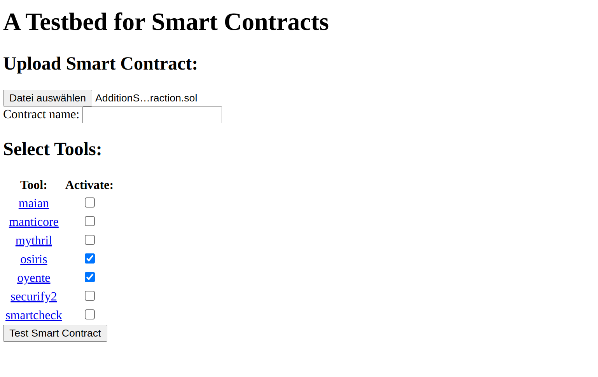
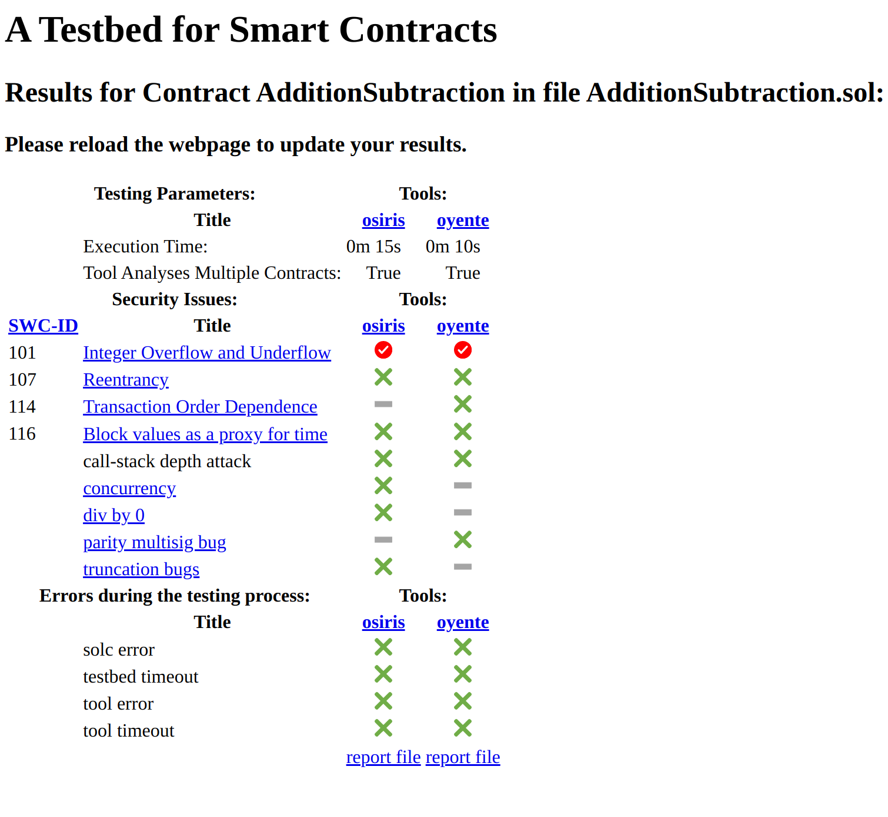

# Testbed

A testbed for smart contracts of the Ethereum Virtual Machine. 

## Overview
The testbed analyses smart contracts given as bytecode or Solidity source code. 

It combines several already existing tools (see [Installed tools](#installed-tools)) and summarizes the security issues they can find. For more detailed information, the user can access the original output of a tool.  

The testbed provides a command-line interface as well as a webserver serving an HTML webpage (see [Run the Testbed](#run-the-testbed)).

It is straightforward to add further tools to the testbed (see [Add a tool to the testbed](#add-a-tool-to-the-testbed)).


## Installed tools
| Tool         | Link                                           |
|--------------|------------------------------------------------|
| Maian        | https://github.com/cryptomental/maian-augur-ci |
| Manticore    | https://github.com/trailofbits/manticore       |
| Mythril      | https://github.com/ConsenSys/mythril           |
| Osiris       | https://github.com/christoftorres/Osiris       |
| Oyente       | https://github.com/melonproject/oyente         |
| Securify 2.0 | https://github.com/eth-sri/securify2           |
| SmartCheck   | https://github.com/smartdec/smartcheck         |


## Install the Testbed
1. Install ubuntu 20.04 (tested with `ubuntu-20.04-live-server-amd64.iso`).
2. Clone this repository.
3. Go to the project directory.
4. Check that you have execute permission on `setup/setup.sh`.
5. Run `sudo ./setup/setup.sh`.

## Run the Testbed
1. Go to the project directory
2. For help execute:  
    `./testbed.sh --help` or  
    `./testbed.sh {analyzer|server|update|remove} --help`
3. **(!!!)** For the `analyze` or `server` command, please run as _super user_.

### Examples
#### Testing a contract via the command-line interface.
1. Type the following command in your `bash` shell:
```
sudo ./testbed.sh analyze resources/examples/AdditionSubtraction.sol --tools oyente osiris
```
2. Check the output:
```
Tool oyente has terminated in 9 secs. and 232 millisecs..
The report-file can be seen here: /example/project/path/AdditionSubtraction-2021-11-08_14-24-56/oyente.txt

Tool osiris has terminated in 14 secs. and 757 millisecs..
The report-file can be seen here: /example/project/path/AdditionSubtraction-2021-11-08_14-24-56/osiris.txt


Security Issues                   osiris       oyente
--------------------------------  -----------  -----------
Integer Overflow and Underflow    found        found
Reentrancy                        not found    not found
Transaction Order Dependence      not checked  not found
Block values as a proxy for time  not found    not found
call-stack depth attack           not found    not found
concurrency                       not found    not checked
div by 0                          not found    not checked
parity multisig bug               not checked  not found
truncation bugs                   not found    not checked

```

#### Testing a contract via the built-in webserver


1. Type the following command in your `bash` shell:
```
sudo ./testbed.sh server
```
2. Upload the contract:


3. See the results:



## Add a tool to the testbed

1. Install the tool.
2. Create a Python script inside `logic/tools`.
3. Inside the script, create a subclass of `ToolTestRun`. A reference implementation for the Oyente tool can be found in `logic/tools/oyente.py`. Make sure the subclass contains the following methods:
   1. `__init__`: Takes a `Contract` instance and the `timeout` (in secs.) after which the tool should stop analyzing the contract.
   2. `_execute_tool`: Is called by the base class and should test the given contract with the tool.
   3. `identify_security_issues`: Should return a list with the security issues the tool has found. 
   4. `identify_errors`: Should return a list with the errors which happened during the testing of the contract.
   5. `create_report`: Should create a detailed report of the testing process.
4. Modify the `test_runner` module.
   1. Import the script from the previous step into the module.
   2. Make sure that `__create_tool_test_run(self, <tool-name>)` creates an instance of the `ToolTestRun` subclass implemented in step 3.. On `__init__`, the subclass should take the `contract` and `timeout` from `self`.
5. Tell the testbed about the new tool.
   1. Run `./testbed.sh update <tool-name> <optional parameters>`.`<optional parameters>` can contain the following parameters:
      1. `--link <link to the tool's webpage>`.
      2. `--bytecode`: Specify if the tool can analyse byte-code files. Defaults to `False` if the option is not provided. _Disclaimer:_ Tools which are not able to analyse Solidity contracts are not supported.
      3. `--solidity`: The tool's preferred Solidity compiler version. Must be one of the installed compilers in `resources/solc-versions`. Leave empty if the tool does not have a preferred version.
      4. `--analyses_all_contracts`: Specify if the tool analyses all contracts in a Solidity file. Defaults to `False`.
   2. Import the security issues the tool tests for as well as known errors which might happen during the tool's execution:
      1. Run `./testbed.sh update <tool-name> --tool_security_issues <tool-security issues>`. `<tool-security-issues` is a CSV-file with the security issues a tool looks for. The first column represents the title, the second one the identifier. The identifier can be used by the tool's `ToolTestRun` subclass to extract security issues from the tool's output.  
      2. Run `./testbed.sh update <tool-name> --tool_errors <tool-errors>`: Similar to `--tool_security_issue`, only that the CSV-File should contain the errors the tool might encounter during the testing process.


## Further information
The testbed was the result of a bachelor thesis. The thesis can be downloaded [here](./resources/A_Testbed_for_Smart_Contracts.pdf). The code of this repository has slightly changed since the thesis was published.

## Disclaimer
Most of the tools only support certain Solidity versions. Therefore, the testbed might fail to test your contract with some tools. Unfortunately, I could not find any information about the exact compatibility of the tools.

## Credits
Lukas Denk - `lukasdenk@web.de`
